  

  

  

 

<strong>AQUA LAUNCH</strong> · animated profile system · powered by live GitHub data

---

### Deploy this style

This profile is built with the **Aqua Launch** template from [Pretty GitHub](https://github.com/Jenesyx/pretty-github) by [Arta Bidkhori](https://github.com/Jenesyx). Follow [SETUP.md](./SETUP.md) to replace the photo, animate your own name, connect your GitHub data, and enable automatic daily updates.
